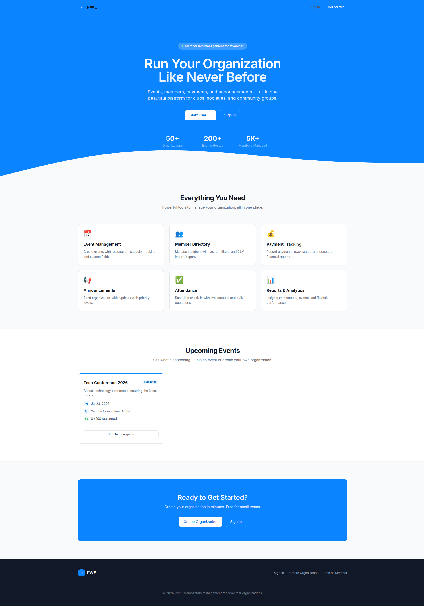

<p align="center">
  
</p>

<h1 align="center">PWE</h1>

<p align="center">
  <strong>Membership management platform for organizations in Myanmar.</strong>
</p>

PWE helps sports clubs, university societies, community groups, and NGOs manage members, run events, accept payments, deliver announcements, and track attendance — all inside private organization workspaces.

---

## Quick Links

| Document | Description |
|----------|-------------|
| [User Guide](docs/user-guide/USER-GUIDE.md) | Visual guide with screenshots for all features |
| [Feature Spec](docs/pwe/Feature-spec.md) | User stories, acceptance criteria, and UI specs for all 7 features |
| [Tech Stack](docs/pwe/tech-stack.md) | Technology choices with rationale and alternatives |
| [Architecture](docs/pwe/architecture.md) | System design, container layout, multi-tenancy model |
| [API Design](docs/pwe/api-design.md) | REST API endpoint reference (40+ endpoints) |
| [Database Schema](docs/pwe/database-schema.md) | ER diagram, table definitions, indexes |
| [Deployment](docs/pwe/deployment.md) | Docker setup, CI/CD, server provisioning, backups |
| [Local Deploy](src/local-deploy/README.md) | Local Docker development environment setup |
| [Dev Deploy](src/dev-deployment/README.md) | DigitalOcean dev/staging deployment with SSL |
| [Security](docs/pwe/security.md) | Auth flow, RBAC, tenant isolation, security checklist |
| [Pre-Production](docs/pwe/pwe-pre-production.txt) | Original product requirements document |

---

## Tech Stack

| Layer | Technology |
|-------|-----------|
| Backend | Node.js + Express + TypeScript |
| Frontend | React + Vite + Tailwind CSS |
| Database | PostgreSQL 16 + Prisma |
| Auth | JWT + bcrypt |
| Container | Docker + Docker Compose |
| CI/CD | GitHub Actions |


See [tech-stack.md](tech-stack.md) for detailed rationale and alternatives.

---

## Features

| # | Feature | Description | Status |
|---|---------|-------------|--------|
| 1 | Organization Workspace | Private multi-tenant workspaces with data isolation | ✅ Implemented |
| 2 | Member Management | CRUD, search, filter, CSV import/export | ✅ Implemented |
| 3 | Event Management | Create events with registration modes and custom fields | ✅ Implemented |
| 4 | Registration Forms | Public and member registration flows | ✅ Implemented |
| 5 | Attendance Tracking | Check-in lists with real-time counters | ✅ Implemented |
| 6 | Payment Tracking | Manual payment recording with status management | ✅ Implemented |
| 7 | Announcements & Reports | Organization announcements and basic analytics | ✅ Implemented |

See [Feature-spec.md](Feature-spec.md) for detailed user stories and acceptance criteria.

### Bug Fixes

- **Event Dates** (Issue #26): End date/time must be after start date/time (validated on both frontend and backend)
- **JWT Security** (Issue #25): Required environment variables enforced at startup (no fallback secrets)
- **Token Refresh Path** (Issue #29): Axios interceptor correctly unwraps nested response path (`data.data.accessToken`)
- **Refresh Instance** (Issue #30): Token refresh uses configured `api` instance instead of raw `axios`
- **Phone Validation** (Issue #36): Organization Settings phone field validates input format (digits and symbols only)
- **Members Filter & Search** (Issue #42): Status filter and search box on Members page correctly refetch data
- **Signup Validation** (Issue #43): Organization creation form shows inline field errors and descriptive backend error messages
- **Member Creation Validation** (Issue #44): Member create/edit forms show inline field errors and descriptive backend error messages
- **Login Error Handling** (Issue #45): Login page shows inline field errors and no longer reloads on failed login

See [docs/fix-issue/](docs/fix-issue/) for detailed fix documentation.

---

## User Guide

For a complete visual guide with screenshots, see **[User Guide](docs/user-guide/USER-GUIDE.md)**.

### Quick Start

1. **Sign Up** — Go to `/signup`, enter your organization name, admin email, and password
2. **Dashboard** — After signup, you land on the admin dashboard with an overview of members, events, and announcements
3. **Add Members** — Navigate to Members page, click "Add Member" to add your first member
4. **Create Events** — Go to Events, click "Create Event" to use the 4-step wizard
5. **Announcements** — Send organization-wide updates with priority levels

### Key Features

| Feature | Description |
|---------|-------------|
| **Member Management** | CRUD, search, filter, status toggle, password reset |
| **Event Management** | 4-step wizard, registration modes, capacity tracking |
| **Attendance** | Real-time check-in, bulk operations, undo support |
| **Payments** | Record payments in MMK, track status, revenue reports |
| **Announcements** | Priority levels (urgent/high/normal/low), archive support |
| **Reports** | Member trends, event performance, revenue analytics |

### User Roles

| Role | Access |
|------|--------|
| **Admin** | Full access — members, events, reports, settings |
| **Staff** | Members, events, reports (no settings) |
| **Member** | Dashboard, events (register), announcements |

---

## Getting Started

### Prerequisites

- Docker + Docker Compose v2+
- Git

### Local Development

```bash
# Clone
git clone https://github.com/pyone-cho/pwe.git
cd pwe/src/local-deploy

# Setup environment
cp .env.example .env

# Start services
make build

# Run migrations
make migrate

# Seed data (optional)
make seed
```

**Services:**
- Frontend: http://localhost (via nginx)
- Backend API: http://localhost/api/v1
- Prisma Studio: http://localhost:5555
- Swagger UI: http://localhost/api/v1/docs

See [local-deploy/README.md](src/local-deploy/README.md) for full setup guide and [dev-deployment/README.md](src/dev-deployment/README.md) for DigitalOcean dev deployment.

---

## Project Structure

```
src/
├── .claude/              # AI agent/skill configs (Claude Code)
│   ├── agents/           # Specialized subagents
│   ├── skills/           # Scaffolding skills
│   └── rules/            # Workflow rules
├── CLAUDE.md             # Project conventions and tech stack
├── backend/              # Express API server
│   ├── src/
│   │   ├── routes/       # API route definitions
│   │   ├── controllers/  # Request handlers
│   │   ├── services/     # Business logic
│   │   ├── middleware/    # Auth, tenant, RBAC
│   │   ├── prisma/       # Prisma client singleton
│   │   ├── swagger/      # OpenAPI docs
│   │   ├── types/        # TypeScript types
│   │   └── utils/        # JWT, email, export helpers
│   ├── prisma/           # Schema and migrations
│   ├── Dockerfile
│   └── package.json
├── frontend/             # React SPA
│   ├── src/
│   │   ├── components/   # Reusable UI components (ui/ + layout/)
│   │   ├── hooks/        # Custom React hooks
│   │   ├── lib/          # Axios instance, utils
│   │   ├── pages/        # Route-level pages
│   │   ├── services/     # API client modules
│   │   └── types/        # TypeScript types
│   ├── Dockerfile.dev
│   └── package.json
├── dev-deployment/       # Docker deployment files
│   ├── docker-compose.dev.yml
│   ├── nginx.conf
│   ├── .env.example
│   ├── .dockerignore
│   ├── generate-certs.sh # SSL certificate generation
│   ├── setup-server.sh   # Server provisioning
│   └── README.md
└── backend/docker-compose.yml  # Basic dev compose (backend + db only)
```

---

## API Overview

Base URL: `/api/v1`

| Category | Endpoints | Auth |
|----------|-----------|------|
| Auth | signup, login, refresh, logout, me | Public / Authenticated |
| Organization | get, update | admin, staff |
| Members | CRUD, search, import, export, status | admin, staff |
| Events | CRUD, status, public listing | admin, staff / Public |
| Registrations | register, list, cancel | Public / Authenticated |
| Attendance | list, check-in, bulk, undo | admin, staff |
| Payments | list, record, update, summary | admin, staff |
| Announcements | CRUD, publish/archive | admin, staff, member |
| Reports | members, events, attendance, payments | admin, staff |

See [api-design.md](api-design.md) for full endpoint documentation with request/response examples.

---

## Multi-Tenancy

Every organization gets complete data isolation:

- **Application level**: Prisma middleware auto-filters by `org_id`
- **Database level**: PostgreSQL Row-Level Security (RLS) policies
- **Auth level**: JWT contains `orgId`, middleware enforces access

See [architecture.md](architecture.md) and [security.md](security.md) for details.

---

## Deployment

### Environments

| Environment | Domain | Purpose |
|-------------|--------|---------|
| Local | localhost | Development |
| Dev | dev.your-domain.com | Shared dev/staging |
| Production | your-domain.com | Live users |

### Deploy

```bash
# Local development
cd src/local-deploy
make build

# Dev deployment (on DigitalOcean droplet)
cd src/dev-deployment
make build

# Production (main branch)
git push origin main
```

See [local-deploy/README.md](src/local-deploy/README.md) for local setup, [dev-deployment/README.md](src/dev-deployment/README.md) for DigitalOcean dev deployment, and [deployment.md](deployment.md) for CI/CD pipeline and backup strategy.

---

## Roadmap

### MVP (2 Weeks)

- [x] Documentation and planning
- [x] Organization workspace + auth
- [x] Member management
- [x] Event management
- [x] Registration forms
- [x] Attendance tracking
- [x] Payment tracking
- [x] Announcements & reports
- [ ] Testing and deployment
- [ ] CI/CD pipeline setup

### Post-MVP

- [ ] QR code attendance
- [ ] Payment gateway integration (KBZ Pay, Wave Money)
- [ ] Email/SMS notifications
- [ ] Advanced analytics
- [ ] Burmese language UI
- [ ] Offline-first PWA
- [ ] Custom branding per org

---

## Security

See [security.md](security.md) for full details.

**Key practices:**
- JWT with 15-min access tokens + refresh token rotation
- **Required environment variables**: `JWT_SECRET` and `REFRESH_TOKEN_SECRET` must be set (application fails to start without them)
- Generate secure secrets: `node -e "console.log(require('crypto').randomBytes(64).toString('hex'))"`
- bcrypt password hashing (cost factor 12)
- RBAC roles: Admin → Staff → Member → Guest
- Tenant isolation on every query
- Rate limiting on all endpoints
- TLS everywhere, security headers via nginx

See [docs/fix-issue/issue-25-weak-jwt-secrets.md](docs/fix-issue/issue-25-weak-jwt-secrets.md) for JWT security fix details.

---

## Contributing

1. Create a feature branch from `main`
2. Make your changes
3. Run linting and tests: `npm run lint && npm test`
4. Submit a pull request to `main`
5. After review and CI passes, merge to `main`

---

## License

MIT — Copyright 2026 pyone-cho
