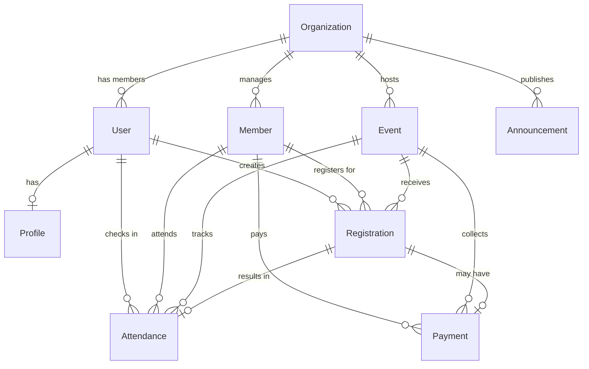

# Database Schema

> PostgreSQL schema design for PWE multi-tenant membership platform.

## Entity-Relationship Diagram



---

## Tables

### `organizations`
Multi-tenant root entity. Every other tenant-scoped table references this.

| Column | Type | Constraints | Notes |
|--------|------|-------------|-------|
| id | UUID | PK, default gen_random_uuid() | |
| name | VARCHAR(255) | NOT NULL | Organization display name |
| slug | VARCHAR(100) | UNIQUE, NOT NULL | URL-friendly identifier, used for subdomain |
| description | TEXT | | Brief org description |
| logo_url | VARCHAR(500) | | Logo image URL |
| phone | VARCHAR(20) | | Contact phone |
| email | VARCHAR(255) | | Contact email |
| address | TEXT | | Physical address |
| settings | JSONB | DEFAULT '{}' | Org-level config (locale, timezone, etc.) |
| status | VARCHAR(20) | DEFAULT 'active' | active / suspended / deleted |
| created_at | TIMESTAMPTZ | DEFAULT NOW() | |
| updated_at | TIMESTAMPTZ | DEFAULT NOW() | |

**Indexes**: `slug` (unique), `status`

---

### `users`
Authentication and identity. Linked to exactly one organization via `org_id`.

| Column | Type | Constraints | Notes |
|--------|------|-------------|-------|
| id | UUID | PK | |
| org_id | UUID | FK → organizations.id, NOT NULL | Tenant isolation |
| email | VARCHAR(255) | NOT NULL | Login identifier |
| password_hash | VARCHAR(255) | NOT NULL | bcrypt hash |
| role | VARCHAR(20) | NOT NULL | admin / staff / member / guest |
| phone | VARCHAR(20) | | For OTP later |
| is_active | BOOLEAN | DEFAULT true | |
| last_login_at | TIMESTAMPTZ | | |
| created_at | TIMESTAMPTZ | DEFAULT NOW() | |
| updated_at | TIMESTAMPTZ | DEFAULT NOW() | |

**Indexes**: `org_id`, `(org_id, email)` unique

---

### `profiles`
Extended user profile info, separated from auth table.

| Column | Type | Constraints | Notes |
|--------|------|-------------|-------|
| id | UUID | PK | |
| user_id | UUID | FK → users.id, UNIQUE, NOT NULL | |
| first_name | VARCHAR(100) | NOT NULL | |
| last_name | VARCHAR(100) | | |
| avatar_url | VARCHAR(500) | | |
| date_of_birth | DATE | | |
| gender | VARCHAR(20) | | male / female / other / prefer_not_to_say |
| address | TEXT | | |
| notes | TEXT | | Admin-only notes |
| metadata | JSONB | DEFAULT '{}' | Custom fields per org |
| created_at | TIMESTAMPTZ | DEFAULT NOW() | |
| updated_at | TIMESTAMPTZ | DEFAULT NOW() | |

---

### `members`
Org-level member records. A Member can be linked to a User account (for self-service) or be standalone (managed by admin).

| Column | Type | Constraints | Notes |
|--------|------|-------------|-------|
| id | UUID | PK | |
| org_id | UUID | FK → organizations.id, NOT NULL | Tenant isolation |
| user_id | UUID | FK → users.id, NULLABLE | Link to login account if exists |
| first_name | VARCHAR(100) | NOT NULL | |
| last_name | VARCHAR(100) | | |
| email | VARCHAR(255) | | |
| phone | VARCHAR(20) | NOT NULL | Primary contact |
| membership_status | VARCHAR(20) | DEFAULT 'active' | active / inactive / suspended |
| membership_type | VARCHAR(50) | | regular / premium / honorary |
| join_date | DATE | DEFAULT CURRENT_DATE | |
| emergency_contact | VARCHAR(255) | | |
| notes | TEXT | | Admin notes |
| metadata | JSONB | DEFAULT '{}' | Custom fields per org |
| created_at | TIMESTAMPTZ | DEFAULT NOW() | |
| updated_at | TIMESTAMPTZ | DEFAULT NOW() | |

**Indexes**: `org_id`, `(org_id, membership_status)`, `(org_id, phone)`, `(org_id, email)`

---

### `events`
Events hosted by an organization.

| Column | Type | Constraints | Notes |
|--------|------|-------------|-------|
| id | UUID | PK | |
| org_id | UUID | FK → organizations.id, NOT NULL | Tenant isolation |
| title | VARCHAR(255) | NOT NULL | |
| description | TEXT | | |
| location | VARCHAR(255) | | Physical or virtual location |
| start_date | TIMESTAMPTZ | NOT NULL | |
| end_date | TIMESTAMPTZ | | |
| capacity | INTEGER | | NULL = unlimited |
| registration_mode | VARCHAR(20) | DEFAULT 'member' | public / member / both |
| status | VARCHAR(20) | DEFAULT 'draft' | draft / published / cancelled / completed |
| requires_payment | BOOLEAN | DEFAULT false | |
| payment_amount | DECIMAL(10,2) | | In local currency (MMK) |
| custom_fields | JSONB | DEFAULT '[]' | Array of field definitions for registration form |
| created_by | UUID | FK → users.id | |
| created_at | TIMESTAMPTZ | DEFAULT NOW() | |
| updated_at | TIMESTAMPTZ | DEFAULT NOW() | |

**Indexes**: `org_id`, `(org_id, status)`, `(org_id, start_date)`

---

### `registrations`
Tracks who registered for which event.

| Column | Type | Constraints | Notes |
|--------|------|-------------|-------|
| id | UUID | PK | |
| event_id | UUID | FK → events.id, NOT NULL | |
| org_id | UUID | FK → organizations.id, NOT NULL | Tenant isolation (denormalized for fast queries) |
| member_id | UUID | FK → members.id, NULLABLE | NULL if guest registration |
| guest_name | VARCHAR(200) | | For non-member registrations |
| guest_email | VARCHAR(255) | | |
| guest_phone | VARCHAR(20) | | |
| status | VARCHAR(20) | DEFAULT 'registered' | registered / cancelled / waitlisted |
| form_data | JSONB | DEFAULT '{}' | Responses to custom_fields |
| registered_at | TIMESTAMPTZ | DEFAULT NOW() | |
| cancelled_at | TIMESTAMPTZ | | |

**Indexes**: `(event_id, member_id)` unique where member_id is not null, `org_id`, `(event_id, status)`

---

### `attendance`
Check-in records for events.

| Column | Type | Constraints | Notes |
|--------|------|-------------|-------|
| id | UUID | PK | |
| event_id | UUID | FK → events.id, NOT NULL | |
| registration_id | UUID | FK → registrations.id, NOT NULL | |
| org_id | UUID | FK → organizations.id, NOT NULL | Tenant isolation |
| checked_in_at | TIMESTAMPTZ | DEFAULT NOW() | |
| checked_in_by | UUID | FK → users.id | Staff member who performed check-in |
| method | VARCHAR(20) | DEFAULT 'manual' | manual / qr / self |
| notes | TEXT | | |

**Indexes**: `(event_id, registration_id)` unique, `org_id`

---

### `payments`
Manual payment tracking for events or memberships.

| Column | Type | Constraints | Notes |
|--------|------|-------------|-------|
| id | UUID | PK | |
| org_id | UUID | FK → organizations.id, NOT NULL | Tenant isolation |
| member_id | UUID | FK → members.id, NOT NULL | |
| event_id | UUID | FK → events.id, NULLABLE | NULL = membership payment |
| registration_id | UUID | FK → registrations.id, NULLABLE | |
| amount | DECIMAL(10,2) | NOT NULL | |
| currency | VARCHAR(3) | DEFAULT 'MMK' | |
| status | VARCHAR(20) | DEFAULT 'pending' | paid / pending / refunded |
| payment_method | VARCHAR(50) | | cash / bank_transfer / mobile_money / other |
| reference_number | VARCHAR(100) | | Receipt or transaction reference |
| receipt_url | VARCHAR(500) | | Uploaded receipt image |
| notes | TEXT | | |
| recorded_by | UUID | FK → users.id | Admin/staff who recorded |
| paid_at | TIMESTAMPTZ | | When payment was made |
| created_at | TIMESTAMPTZ | DEFAULT NOW() | |
| updated_at | TIMESTAMPTZ | DEFAULT NOW() | |

**Indexes**: `org_id`, `(member_id, event_id)`, `status`

---

### `announcements`
Organization-wide or event-specific announcements.

| Column | Type | Constraints | Notes |
|--------|------|-------------|-------|
| id | UUID | PK | |
| org_id | UUID | FK → organizations.id, NOT NULL | Tenant isolation |
| event_id | UUID | FK → events.id, NULLABLE | NULL = org-wide announcement |
| title | VARCHAR(255) | NOT NULL | |
| content | TEXT | NOT NULL | |
| priority | VARCHAR(20) | DEFAULT 'normal' | low / normal / high / urgent |
| status | VARCHAR(20) | DEFAULT 'draft' | draft / published / archived |
| published_at | TIMESTAMPTZ | | |
| created_by | UUID | FK → users.id | |
| created_at | TIMESTAMPTZ | DEFAULT NOW() | |
| updated_at | TIMESTAMPTZ | DEFAULT NOW() | |

**Indexes**: `org_id`, `(org_id, status)`, `(org_id, published_at DESC)`

---

### `refresh_tokens`
JWT refresh token storage for session management.

| Column | Type | Constraints | Notes |
|--------|------|-------------|-------|
| id | UUID | PK | |
| user_id | UUID | FK → users.id, NOT NULL | |
| token_hash | VARCHAR(255) | NOT NULL | SHA-256 hash of the refresh token |
| expires_at | TIMESTAMPTZ | NOT NULL | |
| created_at | TIMESTAMPTZ | DEFAULT NOW() | |
| revoked_at | TIMESTAMPTZ | | Set when token is invalidated |

**Indexes**: `user_id`, `token_hash` (unique), `expires_at`

---

## Multi-Tenancy Pattern

Every tenant-scoped table has an `org_id` column. This enables:

1. **Application-level isolation**: Prisma middleware automatically injects `WHERE org_id = ?` on all queries.
2. **Database-level isolation**: PostgreSQL Row-Level Security (RLS) policies as a safety net.
3. **Efficient queries**: Composite indexes on `(org_id, ...)` columns.

### RLS Policy Example

```sql
-- Enable RLS on a table
ALTER TABLE members ENABLE ROW LEVEL SECURITY;

-- Policy: users can only see rows for their org
CREATE POLICY org_isolation ON members
  USING (org_id = current_setting('app.current_org_id')::uuid);
```

The backend sets `app.current_org_id` per request via a connection-level setting.

---

## Migration Strategy

Using Prisma Migrate for schema management:

```bash
# Create migration
npx prisma migrate dev --name add_event_table

# Apply to production
npx prisma migrate deploy

# Generate Prisma Client
npx prisma generate
```

### Naming Convention
Migrations: `YYYYMMDDHHMMSS_descriptive_name`

---

## Seed Data

For development and testing:

```typescript
// prisma/seed.ts
// Seed an organization, admin user, and sample members
// for local development and test environments
```

---

## Index Strategy Summary

| Table | Primary Indexes | Composite Indexes |
|-------|----------------|-------------------|
| organizations | id | slug (unique) |
| users | id | (org_id, email) unique |
| members | id | (org_id, status), (org_id, phone) |
| events | id | (org_id, status), (org_id, start_date) |
| registrations | id | (event_id, member_id) unique partial |
| attendance | id | (event_id, registration_id) unique |
| payments | id | (member_id, event_id), (org_id, status) |
| announcements | id | (org_id, status), (org_id, published_at DESC) |
