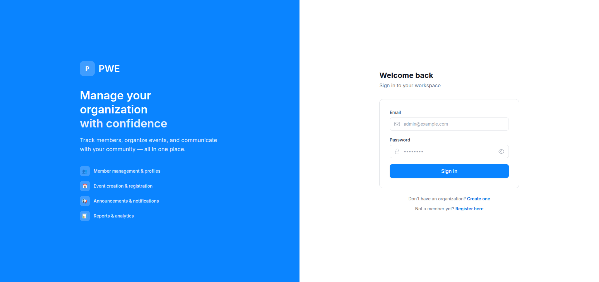
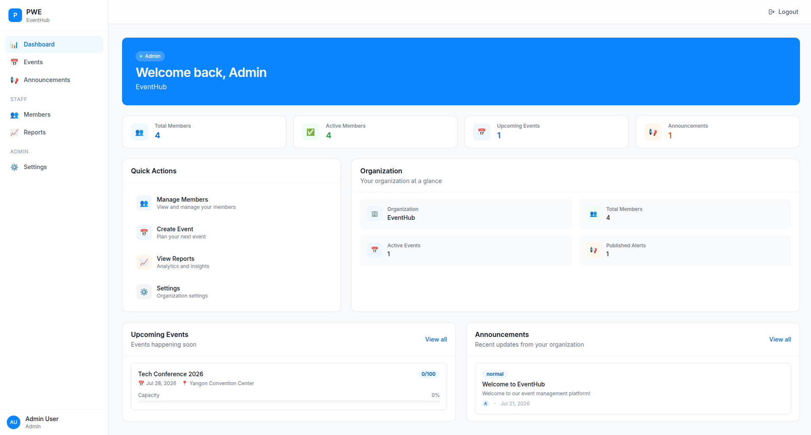
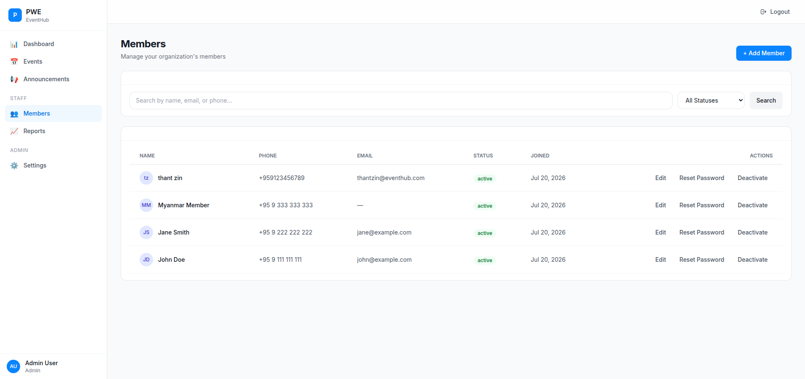
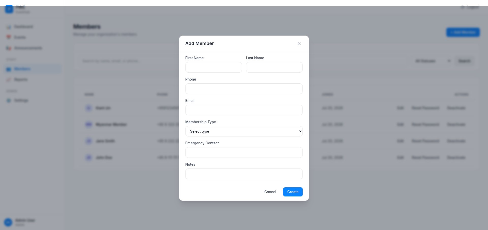
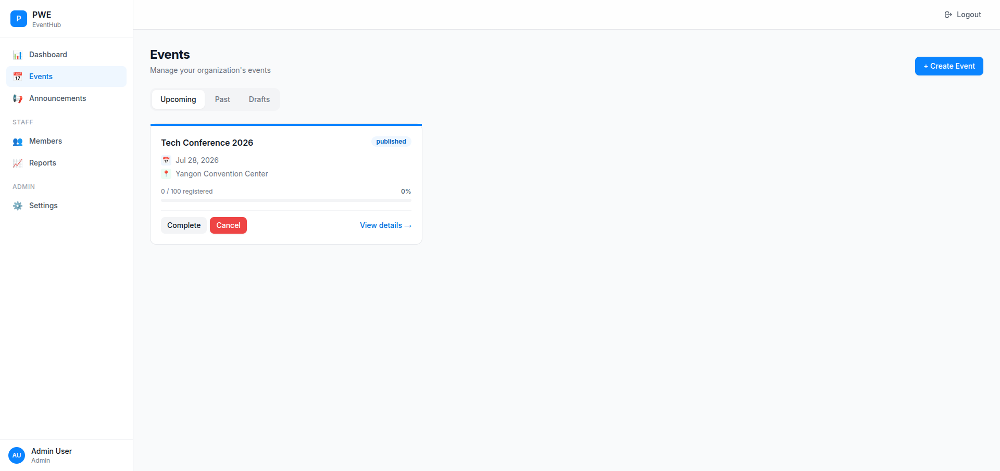
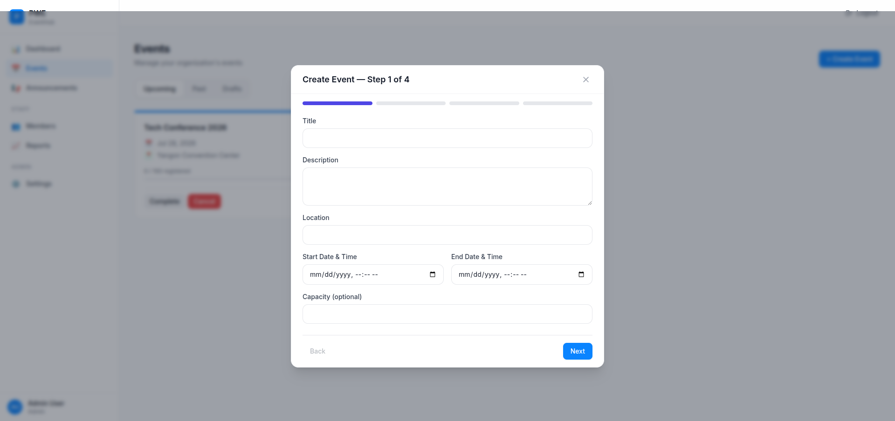
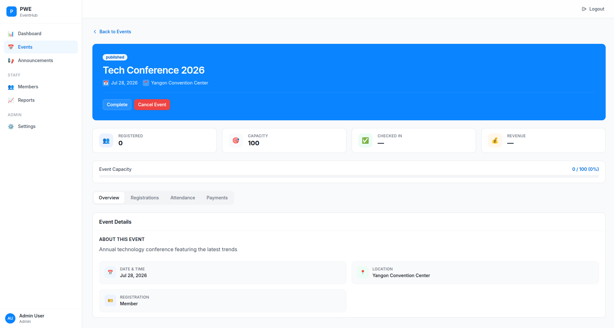
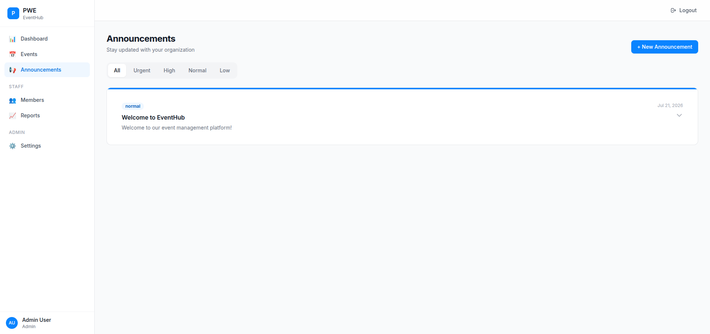
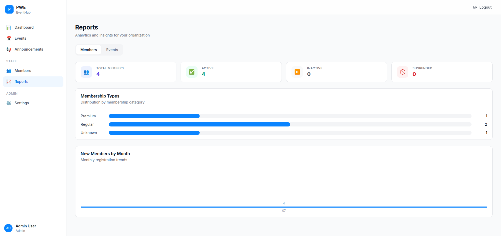
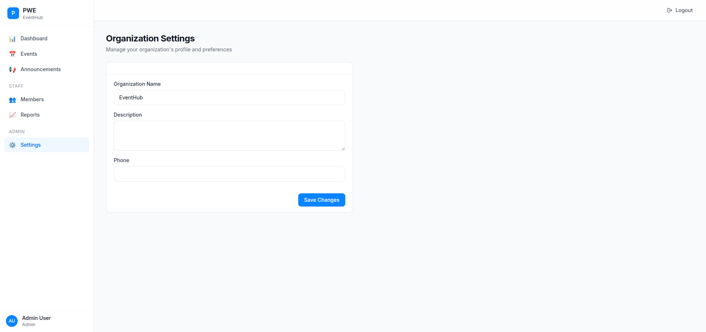

# PWE User Guide

**PWE** is a membership management platform designed for organizations in Myanmar. It provides tools for managing members, events, payments, announcements, and attendance — all in one place.

---

## Table of Contents

1. [Getting Started](#getting-started)
2. [Dashboard](#dashboard)
3. [Member Management](#member-management)
4. [Event Management](#event-management)
5. [Announcements](#announcements)
6. [Reports & Analytics](#reports--analytics)
7. [Settings](#settings)

---

## Getting Started

### Landing Page

When you visit PWE, you'll see the landing page with an overview of features and upcoming public events.

### Creating an Organization

1. Click **"Get Started"** or **"Create Organization"**
2. Fill in your organization details:
   - Organization Name
   - Workspace Slug (auto-generated from name)
   - Admin first/last name
   - Email and password
3. Click **"Create Organization"**

Your organization and admin account will be created instantly.

### Logging In

Navigate to the login page and enter your email and password.

> **Tip:** If you enter wrong credentials, you'll see helpful error messages like "Invalid email or password" instead of technical error codes.

---

## Dashboard

After logging in, you'll see the dashboard with an overview of your organization.

### Dashboard Features

| Section | Description |
|---------|-------------|
| **Stats Cards** | Total members, active members, upcoming events, announcements |
| **Quick Actions** | shortcuts to manage members, create events, view reports, and settings |
| **Organization** | Your org name, member count, active events, and published alerts |
| **Upcoming Events** | Event cards with dates, locations, and capacity progress |
| **Announcements** | Recent updates sorted by priority (urgent > high > normal > low) |

---

## Member Management

The Members page lets you view, add, edit, and manage all organization members.

### Features

- **Search & Filter** — Find members by name, email, or phone. Filter by status (Active/Inactive/Suspended)
- **Member Table** — View all members with their name, phone, email, status, and join date
- **Actions per Member:**
  - **Edit** — Update member profile information
  - **Reset Password** — Generate a temporary password and share it with the member
  - **Deactivate/Activate** — Toggle member status

### Adding a New Member

Click the **"+ Add Member"** button to open the member form.

Fill in the required fields:
- First Name, Last Name, Phone (required)
- Email, Membership Type, Emergency Contact, Notes (optional)

---

## Event Management

Create and manage events with registration, attendance tracking, and payment collection.

### Event Tabs

| Tab | Description |
|-----|-------------|
| **Upcoming** | Published events that haven't happened yet |
| **Past** | Completed events |
| **Drafts** | Events saved as drafts (admin/staff only) |

### Creating an Event

Click **"+ Create Event"** to open the 4-step wizard:

**Step 1 — Basic Info:**
- Title, Description, Location
- Start/End date and time
- Capacity (optional)

**Step 2 — Registration:**
- Registration mode: Members Only, Public, or Both
- Payment settings (enable payments and set amount in MMK)

**Step 3 — Custom Fields** (placeholder for future use)

**Step 4 — Review:**
- Review all details
- **Save as Draft** or **Publish**

### Event Detail

Click any event card to see full details:

#### Admin/Staff Tabs

| Tab | Features |
|-----|----------|
| **Overview** | Event description, date/time, location, payment info |
| **Registrations** | Search and view all registrations, cancel registrations |
| **Attendance** | Check-in members with checkboxes, bulk check-in, undo check-ins |
| **Payments** | View payment summary (expected/collected/pending), payment records |

#### Member Actions

- **Register** — Sign up for an event
- **Cancel Registration** — Withdraw from an event

### Event Status Actions (Admin/Staff)

| Current Status | Available Actions |
|----------------|-------------------|
| Draft | Publish |
| Published | Complete, Cancel |
| — | — |

---

## Announcements

Send organization-wide updates with priority levels.

### Priority Levels

| Priority | Description |
|----------|-------------|
| **Urgent** | Critical alerts requiring immediate attention |
| **High** | Important updates |
| **Normal** | Regular announcements |
| **Low** | Informational notices |

### Features

- **Filter by Priority** — View all, urgent, high, normal, or low announcements
- **Expand/Collapse** — Click any announcement to read the full content
- **Create** (Admin/Staff) — Click "+ New Announcement" to create a new post
- **Archive** (Admin/Staff) — Remove announcements from the active list

---

## Reports & Analytics

View insights about your members and events.

### Members Tab

| Metric | Description |
|--------|-------------|
| **Summary Cards** | Total, Active, Inactive, Suspended member counts |
| **Membership Types** | Bar chart showing distribution (Regular, Student, Honorary, Lifetime) |
| **New Members by Month** | Monthly registration trends |

### Events Tab

| Metric | Description |
|--------|-------------|
| **Summary Cards** | Total Events, Average Attendance %, Total Revenue (MMK) |
| **Event Performance** | Table with registrations, attendance rate, and revenue per event |

---

## Settings

Manage your organization's profile (admin only).

### Available Settings

- **Organization Name** — Your organization's display name
- **Description** — A brief description of your organization
- **Phone** — Contact phone number
- **Slug** — Display-only workspace identifier

Click **Save** to apply changes.

---

## User Roles

PWE supports three user roles with different access levels:

| Feature | Admin | Staff | Member |
|---------|:-----:|:-----:|:------:|
| Dashboard | ✅ | ✅ | ✅ |
| Events (view) | ✅ | ✅ | ✅ |
| Events (create/edit) | ✅ | ✅ | ❌ |
| Members | ✅ | ✅ | ❌ |
| Reports | ✅ | ✅ | ❌ |
| Settings | ✅ | ❌ | ❌ |
| Announcements (create) | ✅ | ✅ | ❌ |

---

## Need Help?

For support or questions, contact your organization administrator.
